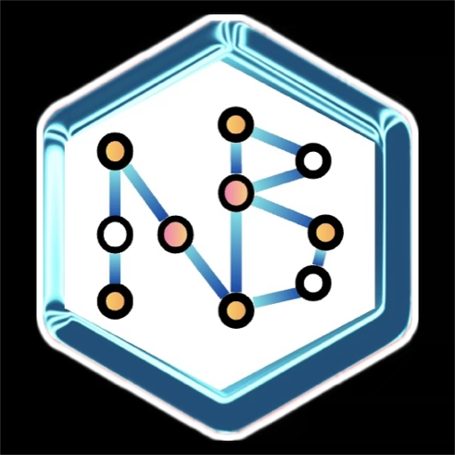

<p align="center">
  
</p>

<h1 align="center">
  Naive Boyes - SafeStride - Botrush 3.0
</h1>

<h3 align="center">
  Machine Learning Classification Interface + Pathfinding Intelligence
</h3>

<p align="center">
  
  
  
  
  
</p>

---


✨ A full-stack application for machine learning classification tasks with file upload capabilities, result visualization, and grid-based intelligent pathfinding — deployed on Vercel (frontend) and Render (backend).

---

## 🚀 Features

- **📁 Modern File Upload Interface**
  - 🖱️ Drag & drop file upload via `FileUpload.js`
  - 📊 Progress tracking with Axios

- **🧠 Advanced ML Processing**
  - 🤖 Trained ML models (`binary.keras`, `multi.keras`) for Ensembled Prediction
  - Achieved an impressive 98.2% accuracy
  - 👁️ Computer vision support via OpenCV (`cv2`)
  - 🔢 NumPy-based data processing

- **🧭 Shortest Path Finder (TSP + BFS Hybrid)**
  - 🟩 Identifies all *safe and supervisable* blocks from the ML-classified image grid.
  - 🧠 Combines **BFS (Breadth-First Search)** for inter-point distance calculation and **TSP (Traveling Salesman Problem)** logic to compute the optimal route.
  - 🚫 Avoids dangerous or unsafe zones like fire or blocked areas, identified through the classifier.
  - 🔄 Ensures **minimum cost traversal** that starts from the bottom-left and covers all required safe points.

- **⚡ Real-time API**
  - 🚀 FastAPI backend with Uvicorn server
  - 📚 Automatic docs at `/docs`

- **📱 Responsive UI**
  - 🎨 Tailwind CSS styling
  - 📲 Mobile-optimized components

---

## 🛠️ Tech Stack

| Area            | Technologies                          |
|------------------|----------------------------------------|
| **🌐 Frontend**    | Next.js 15, React, Tailwind CSS, Axios |
| **🔙 Backend**     | FastAPI, Uvicorn, Python 3.10+        |
| **🤖 ML**          | TensorFlow/Keras, OpenCV, NumPy        |
| **🧭 Pathfinding** | Custom TSP-BFS Hybrid Algorithm        |
| **☁️ Deployment**  | Vercel (Frontend), Render (Backend)    |

---

## 🌍 Live Demo

  [Try it Out!](https://safe-strider.vercel.app/)

---

## 🛠️ Installation

### Frontend (Next.js)
```bash
cd nikhil-yadav15-botrush_3.0_naiveboyes/NextApp
npm install
npm run dev
